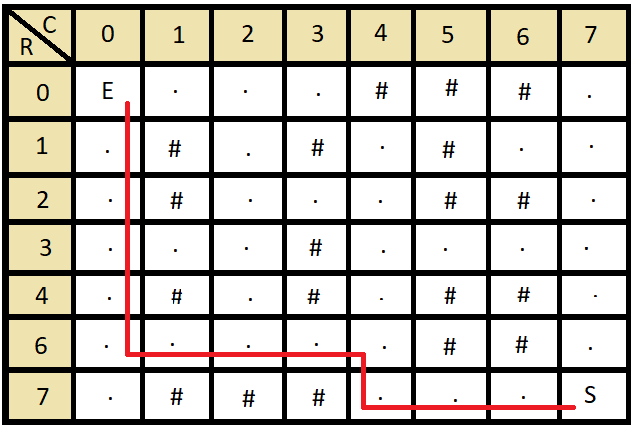

# Resolver um labrinto pelo método de Busca em Profundidade(DFS)

 
 

Busca em Profundidade é um algoritmo normalmente ultilizado para realizar busca ou travsseia em árvores, mas pode ser aplicado em outros casos também. Um desses casos é em matrizes, que podem ser labirintos, para chegar de uma determinada posição inicial até uma determindada posição final, em labirintos essas seriam a entrada e saída dele. Para este algoritmo há duas estruturas importantes a matriz que é o labirinto e a pilha dinâmica que guarda o caminho percorrido.

  A matriz é uma estrutura que tem tamanho, largura e o dado de cada posição. Para um labirinto, que para ser válido ele deve ter uma entrada e uma saída não fechadas, de tamanho n e largura m cada posição pode ter um dos tipos de dado a seguir:
  <ul>
    <li>"E" - Simboliza a entrada do labirinto, só há uma por labirinto</li>
    <li>"S" - Simboliza a saída do labirinto, só há uma por labirinto</li>
    <li>"." - Simboliza um caminho passável no labirinto, só há uma por labirinto</li>
    <li>"#" - Simboliza uma parede no labirinto, só há uma por labirinto</li>
  </ul>
  O labirinto a seguir é um labirinto de exemplo, a onde o caminho vermelho representa uma forma de passar por ele:
  

    
  

# Compilação e Execução

A lista dinâmica disponibilizada possui um arquivo Makefile que realiza todo o procedimento de compilação e execução. Para tanto, temos as seguintes diretrizes de execução:

| Comando                |  Função                                                                                           |                     
| -----------------------| ------------------------------------------------------------------------------------------------- |
|  `make clean`          | Apaga a última compilação realizada contida na pasta build                                        |
|  `make`                | Executa a compilação do programa utilizando o gcc, e o resultado vai para a pasta build           |
|  `make run`            | Executa o programa da pasta build após a realização da compilação                                 |
