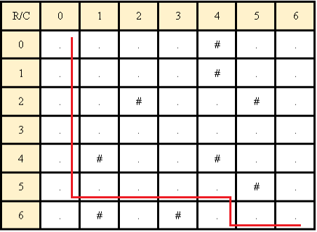
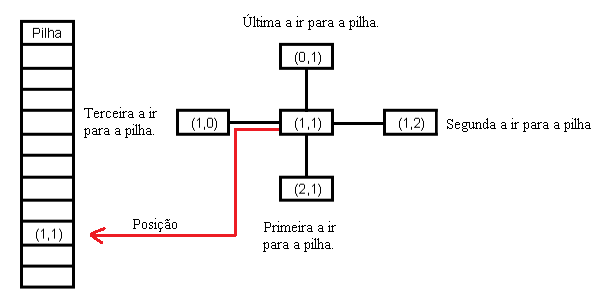

# Labrinto por Busca em Profundidade(DFS)

 
 

Busca em Profundidade é um algoritmo normalmente ultilizado para realizar busca ou travsseia em árvores, mas pode ser aplicado em outros casos também. Um desses casos é em matrizes, que podem ser labirintos, para chegar de uma determinada posição inicial até uma determindada posição final, em labirintos essas seriam a entrada e saída dele. Para este algoritmo há duas estruturas importantes a matriz que é o labirinto e a pilha dinâmica que guarda o caminho percorrido.

  A estrutua da matriz possui um tamanho, uma largura, o dado de cada posição da matriz e as posições que poderá caminhar(Abaixo da posição, à esquerda da posição ou à direita da posição). Esta irá representar um labirinto de tamanho n e largura m em que cada posição pode ter um dos tipos de dado a seguir:
  <ul>
    <li>"." - Simboliza um caminho passável no labirinto.</li>
    <li>"#" - Simboliza uma parede no labirinto.</li>
  </ul>
  E para um labirinto ser válido tem que exister pelo menos um caminho da entrada para o final. O labirinto a seguir é um labirinto 7x7 válido de exemplo, o caminho vermelho representa uma das formas de passar por ele:

  

  A estrutura pilha dinâmica será utilizada para guardar o caminho tomado da entrada para chegar na saída. A pilha dinâmica é uma variante do modelo de pilha estática, onde há um ponteiro que aponta para o topo da pilha, um ponteiro que aponta para o fundo da pilha e os dados que possuem um valor que é passado para chegar nele. A estrutura pode ser vista pela visualização gráfica abaixo:  

  

  Com as estruturas explicadas agora vamos entender como o método DFS funciona. Primeiro a posição inicial é adicionada a pilha, depois o algoritmo irá olhar se pode ir para baixo, direita, esquerda ou cima nesta ordem (Neste último caso, considerado como voltar). Após ter escolhido o caminho a ser tomado, O código vai adicionar as posições deste caminho na pilha até a posição que ele não poderá mover na direção escolhida. Após isto, o algoritmo vai pegar a posição do topo da pilha e verificar se há algum outro caminho para se mover nela, se houver, o mesmo vai caminhar até o final dela, senão, ele irá retirar está posição da pilha e tentar com a posição anterior, assim por a diante até o topo ser a posição final. Os desenhos a seguir representam este processo.

  Verificação das posições ao redor para mover na direção, no exemplo o algoritmo primeiramente irá para baixo, depois para direita, depois para esquerda e por último para cima:

  

  Exemplo de parada: O algoritmo moveu-se para baixo e parou na última posição da linha (6,0), não tendo mais para onde seguir.

  

 Ainda no exemplo, depois de parar na posição (6,0),o algoritmo mudou sua direção. Como não havia nenhum caminho para ir a não ser voltar de onde veio, a posição (6,0) é retirada da pilha e verifica-se a nova posição (5,0) dá para mover a direita:

  

  Conclusão do labirinto e sua pilha:

  

# Algoritmo
<h3>pilha.h e pilha.c</h3>

Nessa estrutura temos a função PUSH e POP (Empilhar e Desempilhar respectivamente), a função FPVazia, que inicializa a pilha vazia e aloca a memória do tamanho do bloco, e a função imprimir, que imprime os valores obtidos na pilha. 

<h3>labirinto.h e labirinto.c</h3>

 Utilizou-se as estruturas Cell e Labirinto para a criação da matriz e análise das posições ao caminhar no labirinto. As funções inicializar e finalizar se refere a inicialização e finalização do labirinto. Com isso, é possivel imprimir o mesmo ultilizando a função ImprimirLab.

A função LerArquivo permite a leitura de arquivo em que está inserido o labirinto. Para a realização da leitura correta é necessário que o labirinto seja descrito com "." como passagem/caminho livre e "#" como a parede que impede de seguir o caminho, além disso é preciso inserir o nome do arquivo com sua extensão para evitar erros. 

    Interações

    As interações são definidas pela função DFS, sendo tratadas apenas pela inserções dentro da pilha. Após conferir cada posição possível para prosseguir, ao acrescentar a posição a pilha, imediatamente é acrescentado 1 a variável count resultando no valor total de interações necessárias para concluir o caminho. não foi considerado as interações de retirada na pilha (considerado como voltar no caminho) já que teoricamente estariamos acrescentando a mesmo posição duas vezes (ida e volta).

<h3>main.c</h3>

No main, inicializamos a pilha vazia e chamos o PUSH (Empilhar) e em seguida pedimos ao usuário o número de linhas e colunas do labirinto disponível no arquivo e consequentemente pedimos o nome do arquivo com a extensão. Inicializamos o labirinto e a leitura do arquivo, para conferir se a leitura esta correta, imprimos o labirinto para questões de comparação (caso o usuário queira conferir o resultado) e atribuimos a variavél iteracoes a função DFS e mostramos o resultado final de interações. Finalizamos a pilha e o labirinto no final.

# Compilação e Execução

A lista dinâmica disponibilizada possui um arquivo Makefile que realiza todo o procedimento de compilação e execução. Para tanto, temos as seguintes diretrizes de execução:

| Comando                |  Função                                                                                           |                     
| -----------------------| ------------------------------------------------------------------------------------------------- |
|  `make clean`          | Apaga a última compilação realizada contida na pasta build                                        |
|  `make`                | Executa a compilação do programa utilizando o gcc, e o resultado vai para a pasta build           |
|  `make run`            | Executa o programa da pasta build após a realização da compilação                                 |

Trabalho realizado Gabriel Júnior Teixeira e Lívia Gonçalves - Maio/2022

